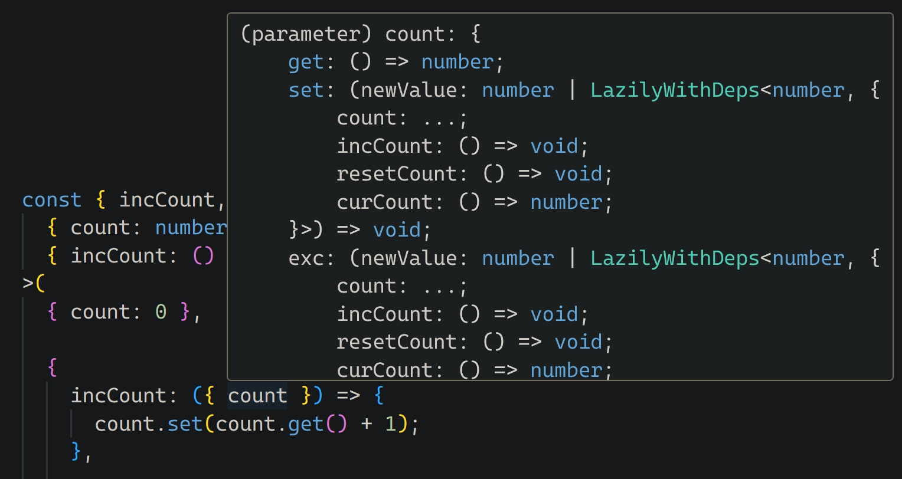
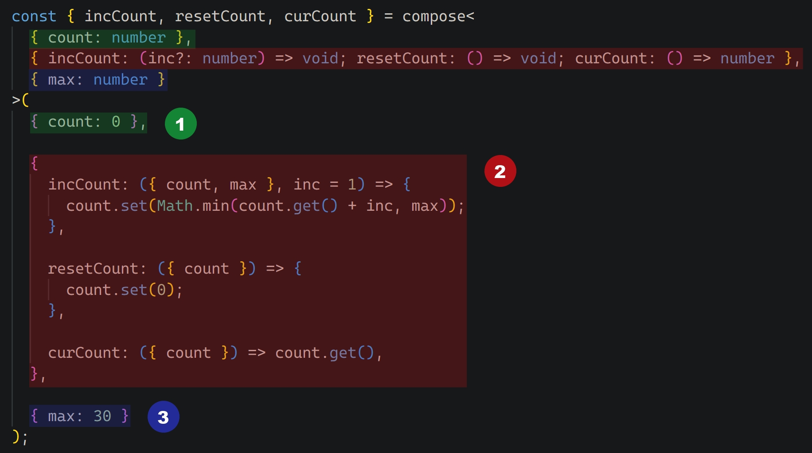

# Alnico:magnet:


_Alnico:magnet:_ is a TypeScript library under development that investigates the potential benefits
of combining functional programming principles with the modularity strengths of object-oriented
programming. Inspired by concepts from functional programming, _Alnico:magnet:_ seeks to introduce a
novel approach to code structure and organization. It achieves this by eliminating the use of `this`
and `new` keywords in favor of composable states and methods bundled into single units.

## Installation

```bash
npm i alnico
```

## Use

This section explores the usage of _Alnico:magnet:_ through a practical example. The example
implements a counter using _Alnico:magnet:_'s composition functionality:

```ts
import { compose } from 'alnico';
/**
 * Alternatively:
 * import alnico from 'alnico';
 *
 * alnico.compose( ... )
 */

const { incCount, resetCount, curCount } = compose<
  { count: number },
  { incCount: () => void; resetCount: () => void; curCount: () => number }
>(
  { count: 0 },

  {
    incCount: ({ count }) => {
      count.set(count.get() + 1);
    },

    resetCount: ({ count }) => {
      count.set(0);
    },

    curCount: ({ count }) => count.get(),
  }
);

curCount();    //0;
incCount();
curCount();    //1;
incCount();
curCount();    //2;
incCount();
curCount();    //3;
resetCount();
curCount();    //0;

```

To illustrate _Alnico:magnet:_'s composition approach, this example constructs a set of interrelated
methods using the compose function. These methods function independently, eliminating the need for a
central managing object. This is achieved by removing the `this` keyword and explicitly passing all
internal dependencies through the composer functions' parameters. This fosters a programming style
with clear and unambiguous dependency management. Additionally, TypeScript's IntelliSense
functionality enhances development by automatically suggesting parameters for each function.



It's important to note that _Alnico:magnet:_'s effectiveness is heavily dependent on TypeScript. The
proposed _Alnico:magnet:_ composition approach wouldn't be as efficient with plain JavaScript. While
it would still function, managing parameter requirements for composer functions and allowed
parameters for dependency methods would become increasingly difficult, especially in complex use
cases.

## Alnico:magnet: Composition Breakdown

_Alnico:magnet:_ compositions consist of three parts, with one being optional. Let's examine them in
detail:



1. **State:** This section defines the variables used within the composition. Each state variable is
   accessible as a dependency in a method composer function. When used as a dependency, each state
   variable behaves like a method bundle with three functions: `get`, `set`, and `exc`. We'll
   explore these functions in more detail later.

2. **Methods composition:** This is the core component of _Alnico:magnet:_. It's responsible for
   producing the final methods as a result of the composition process. The source for these methods
   comes from the composers passed as the second argument. The key difference between composers and
   the methods they create is that composers have an extra parameter placed first, before the rest
   of the arguments accepted by the methods. This extra argument is the bundle that contains the
   dependencies as named properties.

   

   Even the method itself can be included in the dependency bundle, allowing for recursion.

   ```ts
   next({ next, mem }, p) {
     if (p <= 1) return p;

     if (p in mem.get()) return mem.get()[p];

     const result = next(p - 1) + next(p - 2);
     mem.get()[p] = result;

     return result;
   },

   ```

3. **Embedded (Optional):** This optional part allows you to define constants that you want to make
   accessible as dependencies to compose methods. It's similar to the concept of dependency
   injection in object-oriented programming. Embedded dependencies are also included in the output
   generated by _Alnico:magnet:_.

> **Naming Inspiration:**
>
> The name _Alnico:magnet:_ is inspired by an iron alloy that combines three additional elements:
> aluminum (_Al_), nickel (_Ni_), and cobalt (_Co_). This combination results in a powerful
> permanent magnet with exceptional resistance to demagnetization.

## State

Continuing from the previous discussion, each state variable in _Alnico:magnet:_ is a wrapper around
three methods: `get`, `set`, and `exc`. As expected, `get()` retrieves the current value,
`set(newValue)` updates the value with a new one, and `exc(newValue)` performs a combination of
reading the old value and writing the new one.

## Lazily

_Alnico:magnet:_ offers a secondary utility function called `lazily`:

```ts
import { lazily }  from 'alnico';
```

This function is designed to work with state variables. It allows you to initialize or set a state
with a value that's calculated only when needed, specifically during calls to `get()` and
`exc(newValue)`. The `lazily` function takes a parameter that's a function receiving a single
argument – the dependencies (similar to those used in method composers).

```ts
const { getState, setState } = compose<
  { v1: number; v2: number },
  {
    calcV2: () => number;
    getState: () => { v1: number; v2: number };
    setState: (f: number) => void;
  },
  { multiply: number; expensiveCalc: (factor: number) => number }
>(
  {
    v1: 10,

    /**
     * Since the `calcV2` method (which depends on the `multiply` variable from the embedded
     * part) isn't defined until the composition is complete (therefore unknown at the
     * beginning), we initialize `v2` lazily.
     */
    v2: lazily(({ calcV2 }) => calcV2()),
  },

  {
    /**
     * We define the method to reuse it in two places. Note that it depends on the embedded
     * part, which is expected to be injected as an option.
     */
    calcV2: ({ v1, multiply }) => v1.get() * multiply,
    getState: ({ v1, v2 }) => ({ v1: v1.get(), v2: v2.get() }),

    setState: ({ v1, v2 }, f) => {
      // It's too expensive to calculate if there's a chance the value will never be requested
      v1.set(lazily(({ expensiveCalc }) => expensiveCalc(f)));

      // If we call `calcV2` right away, it undermines our effort to set `v1` lazily
      v2.set(lazily(({ calcV2 }) => calcV2()));
    },
  },

  /**
   * The embedded part serves to hold injected dependencies when `compose` is used inside a
   * factory function.
   */
  {
    // `multiply` is assumed to be an injected parameter
    multiply: 3,

    // This method is injected too
    expensiveCalc,
  }
);

getState();    // { v1: 10, v2: 30 }
setState(5);
getState();    // { v1: 5, v2: 15 }
setState(8);   // Nothing was calculated
setState(10);
getState();    // { v1: 55, v2: 165 }
```

Another scenario where `lazily` proves useful is within the **embedded** part:

```ts
const { minOf3, minOf5 } = compose<
  { v1: number; v2: number },
  { min: () => number; setVs: (v1: number, v2: number) => void },
  {
    base: number;
    levelUp: (v: number) => number;
    minOf3: (v1: number, v2: number, v3: number) => number;
    minOf5: (v1: number, v2: number, v3: number, v4: number, v5: number) => number;
  }
>(
  {
    /**
     * `lazily` here prevents executing the methods without prior initialization of variables
     * `v1` and `v2`.
     */
    v1: lazily(() => {
      throw new Error('The value must be set');
    }),

    v2: lazily(() => {
      throw new Error('The value must be set');
    }),
  },

  {
    min: ({ v1, v2 }) => (v1.get() > v2.get() ? v2.get() : v1.get()),

    setVs: ({ v1: { set: setV1 }, v2: { set: setV2 } }, v1, v2) => {
      setV1(v1);
      setV2(v2);
    },
  },

  {
    base: 50,

    // `levelUp` depends on methods and `base` which is another embedded variable
    levelUp: lazily(({ setVs, min, base }) => (v) => {
      setVs(base, v);

      return min();
    }),

    /**
     * The result of the following `lazily` execution is 2 more embedded methods that we emit
     * using the spreading syntax.
     */
    ...lazily(({ min, setVs, levelUp }) => ({
      minOf3: (v1, v2, v3) => {
        setVs(v1, v2);
        setVs(min(), v3);

        return levelUp(min());
      },

      /**
       * `minOf5` depends on `minOf3`. Both are results of the same lazy execution. We can use
       * `lazily` inside it making sure that `minOf3` is already defined at the moment.
       */
      minOf5: lazily(
        ({ minOf3, levelUp }) =>
          (v1, v2, v3, v4, v5) =>
            levelUp(minOf3(minOf3(v1, v2, v3), v4, v5))
      ),
    })),
  }
);

minOf3(20, 5, 15);            // 5
minOf3(60, 55, 80);           // 50
minOf5(120, 60, 70, 80, 65);  // 50
minOf5(120, 80, 75, 54, 33);  // 33
```

<style>
  img[alt="Alnico"] {
    width: clamp(30%, 200px, 100%);
    display: block;
    margin: auto;
  }

  img[alt*="(snippet)"] {
    width: min(500px, 100%);
    display: block;
    margin: 2rem 0
  }

  blockquote {
    margin-top: 2rem;
    margin-bottom: 2rem;
  }
</style>
